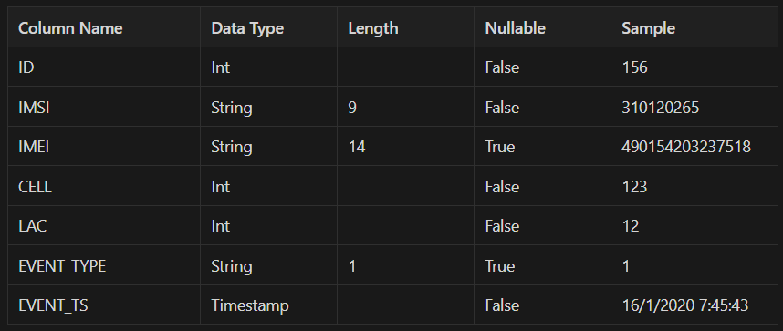
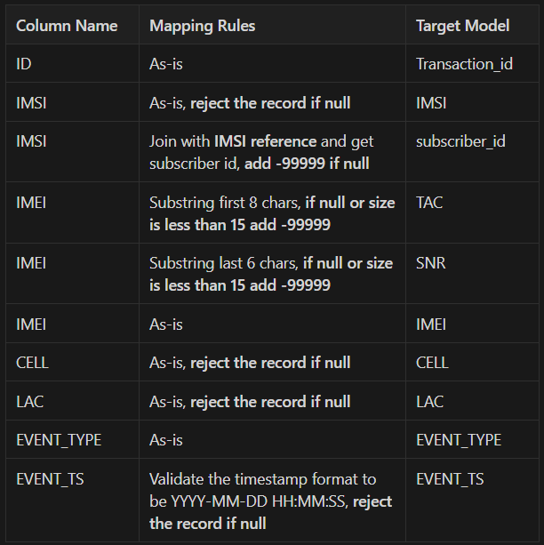
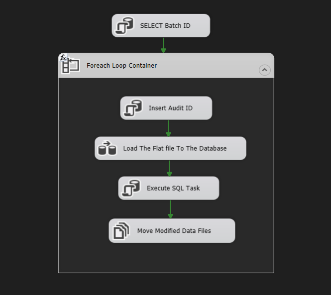
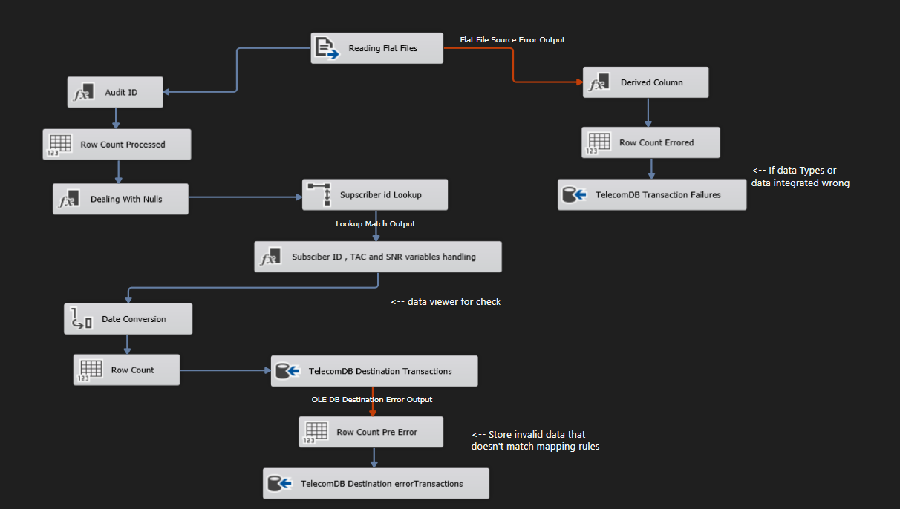
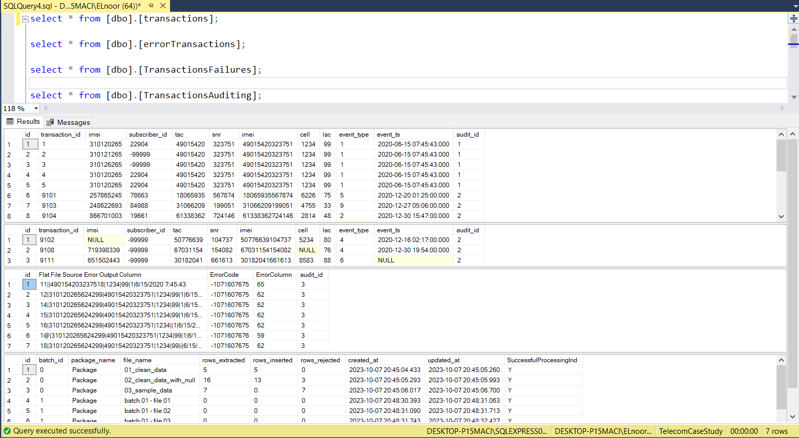

# ETL Telecom Case Study Using SSIS 

## Project Description 
This project involves as ETL developer role at a telecommunications company involves managing the flow of data from the CSV files, ensuring data quality, storing accepted data in the database, keeping track of rejected records, and maintaining a connection between the database and the original CSV files for future reference.

**My tasks include:**

* **Data Extraction:** 
    Extract data from the CSV files regularly.
  
* **Data Transformation:** 
    Transforming the data by identifying and storing rejected records in a separate table along with the original file name. Additionally, record data like the total number of movements, successful database entries, and rejected records.
  
* **Data Loading:** 
    After processing and transforming the data, load it into the database.

* **Data Linking:** 
    Establish links or associations between the data stored in the database and the original CSV file, enabling easy retrieval and reference.

* **File Handling:** 
    Once the data is successfully stored in the database and the necessary information is recorded, move the CSV file to a different folder for archival or further processing.
  

## Data Schema
   

## Mapping Rules
   

## SSIS Snapshots
### Control Flow:

### Data Flow:
   

## SQL Server Snapshots
   
